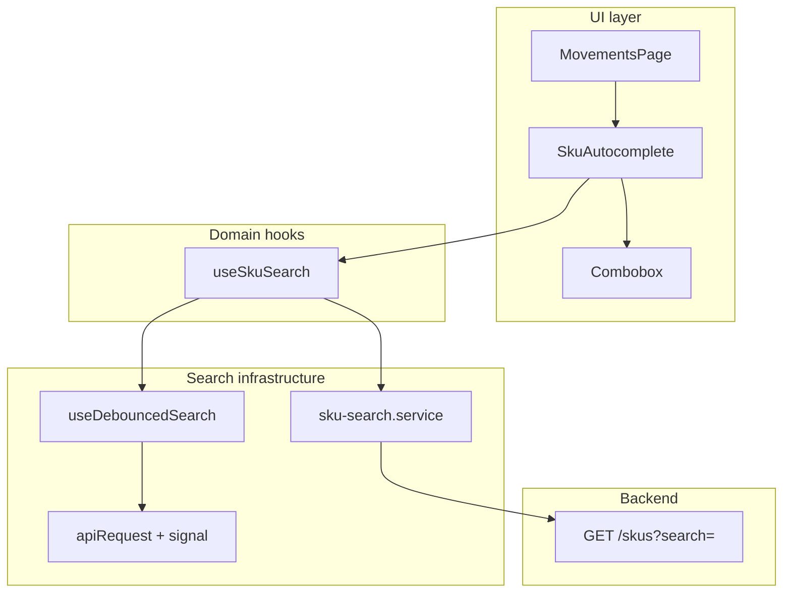

# PHASE 1 (Search UX): Search-first SKU autocomplete + API list contract

**Status:** Complete — merged via PR #11  
**Branch:** `feature/phase-1-search-autocomplete`  
**Duration:** ~1–2 days  
**Focus:** Reusable search infrastructure, operator-friendly SKU selection, consistent paginated API responses

---

## Goal

Evolve InventoryHub from **dropdown-first** SKU selection to **search-first** selection, without building a monolithic autocomplete component. Lay platform rules so warehouse/supplier pickers can reuse the same patterns later.

Operators on the Movements page should:

1. Type 2+ characters of a SKU code or name
2. See up to 10 server-matched results (debounced)
3. Pick with mouse or keyboard (↑/↓/Enter)
4. Never depend on loading thousands of SKUs into a `<select>`

---

## Problem we solved

| Before | After |
| --- | --- |
| `MovementsPage` loaded `GET /skus?perPage=25` for three `<select>` dropdowns | SKU search runs only when typing (`GET /skus?search=…&perPage=10`) |
| List APIs mixed `data[]` vs `items[]` | All list endpoints use `PaginatedResponse`: `items`, `page`, `perPage`, `total`, `totalPages` |
| No request cancellation on fast typing | `AbortSignal` forwarded to `fetch`; TanStack Query cancels stale requests |
| SKU logic would have lived in one 800-line component | Split: service → hook → generic debounce → generic UI → thin SKU wrapper |

---

## Architecture (layered — do not collapse layers)



**Rule:** `Combobox` and `useDebouncedSearch` must stay entity-agnostic. SKU-only knowledge lives in `sku-search.service.ts`, `useSkuSearch.ts`, and `SkuAutocomplete.tsx`.

---

## What we shipped

### Commit 1 — API pagination contract

**Message:** `refactor(api): standardize paginated list responses to use items`

**Backend**

| File | Change |
| --- | --- |
| `apps/backend/src/routes/skus.ts` | List response uses `items` instead of `data` |
| `apps/backend/src/routes/warehouses.ts` | Same |
| `apps/backend/src/routes/alerts.ts` | Same |
| `apps/backend/src/routes/purchase-orders.ts` | Same + `total` / `totalPages` |
| `apps/backend/src/services/purchase-order.service.ts` | Added `count()` for PO list pagination |

**Frontend**

| File | Change |
| --- | --- |
| `apps/frontend/src/types/api.ts` | `PaginatedResponse<T>` replaces `ListResponse<T>` |
| `apps/frontend/src/pages/*` | Consumers use `.items` instead of `.data` |

### Commit 2 — Search infrastructure + SKU autocomplete

**Message:** `feat(frontend): add search-first SKU autocomplete for movements`

**New files**

| File | Purpose |
| --- | --- |
| `apps/frontend/src/lib/search/sku-search.service.ts` | Domain API: `searchSkus(term, signal)` → `GET /skus?search=` |
| `apps/frontend/src/hooks/useDebouncedSearch.ts` | Generic debounce + React Query + race-safe cancellation |
| `apps/frontend/src/hooks/useSkuSearch.ts` | Wires SKU service to debounced search |
| `apps/frontend/src/components/Combobox.tsx` | Generic input + dropdown + keyboard nav |
| `apps/frontend/src/components/SkuAutocomplete.tsx` | Thin SKU picker; `onChange(id, sku)` for optimistic UI |

**Updated files**

| File | Change |
| --- | --- |
| `apps/frontend/src/lib/api.ts` | Optional `signal` on `apiRequest` (abort stale fetches) |
| `apps/frontend/src/lib/query-keys.ts` | `skuSearch(term)` factory key (separate from list cache) |
| `apps/frontend/src/pages/MovementsPage.tsx` | Replaced `SelectSku` with `SkuAutocomplete`; removed bulk SKU preload |
| `apps/frontend/src/App.css` | Combobox dropdown styles |

---

## UX behavior (Movements)

| State | What the operator sees |
| --- | --- |
| Idle | Placeholder: “Search SKU code or name…” |
| &lt; 2 chars | Hint: “Type at least 2 characters” |
| Searching | “Searching…” in dropdown |
| Results | Up to 10 rows: `CODE — Name` |
| Selected | Input shows selected label; **Clear** button resets |
| Submit | Receipt / adjustment / transfer disabled until `skuId` is set |

**Keyboard:** ArrowUp/Down, Enter (select), Escape (close list). Barcode scanners that emit Enter after a code can select the first match once debounced search returns.

**Optimistic adjustment:** Parent keeps `selectedSku` (`id`, `code`, `name`) so adjustment rows do not need a second lookup from a preloaded SKU list.

---

## API contract (platform rule)

All paginated list endpoints return:

```json
{
  "items": [],
  "page": 1,
  "perPage": 20,
  "total": 0,
  "totalPages": 0
}
```

SKU autocomplete uses existing list endpoint:

```
GET /skus?search={term}&perPage=10&page=1
```

Response shape: `PaginatedResponse<Sku>`; picker maps to `{ id, code, name }`.

---

## Verification

**Automated**

```bash
pnpm --dir apps/backend exec tsc --noEmit
pnpm test:unit
pnpm test:int
pnpm --dir apps/frontend build
pnpm --dir apps/frontend lint
```

**Manual (Movements page)**

- [ ] Type 2+ chars → dropdown shows matching SKUs
- [ ] Type quickly → only latest results shown (no stale “lap” overwriting “laptop”)
- [ ] Select SKU → label shows `CODE — Name`
- [ ] Clear → selection reset; submit buttons disabled
- [ ] Receipt / adjustment / transfer succeed with selected SKU
- [ ] Adjustment optimistic row shows correct SKU code in history table

**API**

- [ ] `GET /skus` returns `items` (not `data`)
- [ ] `GET /purchase-orders` includes `total` and `totalPages`

---

## Exit checklist

- [x] Branch `feature/phase-1-search-autocomplete` created from `main`
- [x] `PHASE_1_SEARCH_AUTOCOMPLETE_PLAN.md` created
- [x] Paginated list contract standardized (backend + frontend)
- [x] `apiRequest` supports `AbortSignal`
- [x] `useDebouncedSearch` (generic) implemented with comments
- [x] `sku-search.service` + `useSkuSearch` implemented
- [x] `Combobox` + `SkuAutocomplete` implemented
- [x] Movements page uses search-first SKU picker
- [x] Frontend build passes
- [x] Backend unit + integration tests pass
- [x] Merged to `main` (PR #11)

---

## Still planned (next branches — not in this PR)

These were scoped in the broader Phase 1 evolution roadmap but intentionally deferred:

| Next item | Branch idea | Why |
| --- | --- | --- |
| `pg_trgm` GIN indexes on SKU (and warehouse) name/code | `feature/pg-trgm-search-indexes` | Keeps autocomplete fast at 10k+ SKUs; zero new services |
| Warehouse session context | `feature/warehouse-session-context` | Default warehouse in header + forms |
| Category + tags schema + CRUD APIs | `feature/category-tags-schema` | Foundation for browse/filter UX in Phase 2 |
| `WarehouseAutocomplete` | Reuse `Combobox` + `useDebouncedSearch` | Same pattern as SKU |
| Category sidebar + tag filters on SKU list | Phase 2 UI | Depends on schema |

---

## Suggested next commits (after merge)

Ask before committing.

1. `feat(db): add pg_trgm GIN indexes for SKU and warehouse search`
2. `feat(frontend): add warehouse session context and topbar selector`
3. `feat(backend): add category and tag schema with assignment APIs`
4. `docs: update project tracker for phase 1 search follow-ups`

---

## How to extend search to another entity (e.g. warehouse)

1. Add `warehouse-search.service.ts` — one function calling `GET /warehouses?search=`
2. Add `useWarehouseSearch.ts` — wraps `useDebouncedSearch` + `queryKeys.warehouseSearch(term)`
3. Add `WarehouseAutocomplete.tsx` — ~30 lines wiring `Combobox` + hook
4. Do **not** duplicate debounce or keyboard logic in the domain component
