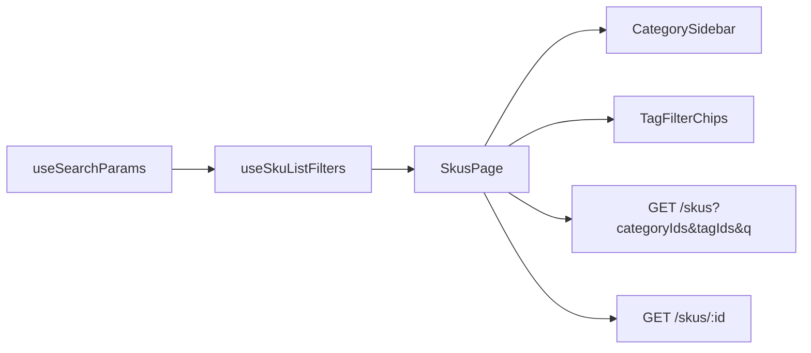

# PHASE 2 (Browse UI): Category sidebar + tag filters on SKU list

**Status:** Complete on branch `feature/phase-2-sku-browse-filters`  
**Depends on:** `PHASE_1_PLATFORM_FOLLOWUP_PLAN.md` (category/tag APIs, merged or on follow-ups branch)  
**Focus:** Amazon-style browse/filter on `/skus` — no new backend tables

---

## Goals

| # | Item | Outcome |
| --- | --- | --- |
| 1 | Category sidebar | Tree from `GET /categories?format=tree`; click filters SKU list |
| 2 | Tag filter chips | Multi-select from `GET /tags`; AND filter via `tagIds[]` |
| 3 | URL state | `?category=&tag=&q=&page=` — shareable/bookmarkable filters |
| 4 | SKU detail strip | Select row → `GET /skus/:id` shows categories + tags |

**Out of scope (later branches):** `WarehouseAutocomplete`, shared `DataTable`, manager category CRUD UI.

---

## Architecture



### URL contract

| Param | Meaning |
| --- | --- |
| `category` | Single category id (expands to descendants server-side) |
| `tag` | Repeated — each selected tag id (AND on server) |
| `q` | Text search (code/name) |
| `page` | Pagination (resets to 1 when filters change) |

List API: `GET /skus?categoryIds[]=<id>&includeDescendants=true&tagIds[]=...&search=...`

---

## File plan

| File | Role |
| --- | --- |
| `types/api.ts` | `Category`, `Tag`, `SkuDetail` types |
| `lib/api.ts` | `toListQueryString` for array query params |
| `lib/taxonomy/category.service.ts` | Fetch category tree |
| `lib/taxonomy/tag.service.ts` | Fetch tags list |
| `hooks/useSkuListFilters.ts` | Sync filters ↔ URL |
| `components/CategorySidebar.tsx` | Nested category navigation |
| `components/TagFilterChips.tsx` | Toggle tag filters |
| `components/SkuDetailStrip.tsx` | Taxonomy on selected SKU |
| `pages/SkusPage.tsx` | Browse layout + wired queries |
| `lib/query-keys.ts` | `categories`, `tags` keys |

---

## Suggested commits

1. `docs: add phase 2 browse UI plan and update tracker`
2. `feat(frontend): add SKU list filters with URL state and taxonomy services`
3. `feat(frontend): add category sidebar and tag chips on SKU page`

---

## Verification

```bash
pnpm --dir apps/frontend build
pnpm --dir apps/backend exec tsc --noEmit
```

**Manual**

- [ ] `/skus` loads category tree in sidebar (needs categories in DB — create via API as manager)
- [ ] Click category → list filters; URL has `?category=`
- [ ] Toggle tags → list filters; URL has `&tag=`
- [ ] Refresh preserves filters
- [ ] Click SKU code → detail strip shows categories/tags
- [ ] Clear category / tags resets list
