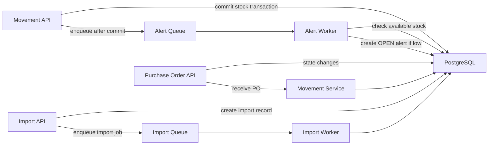
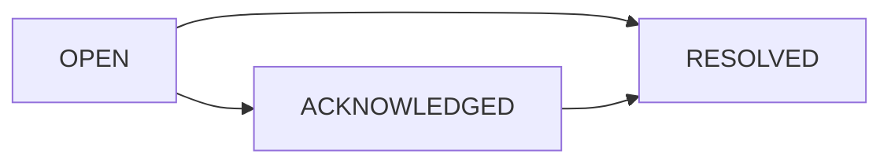
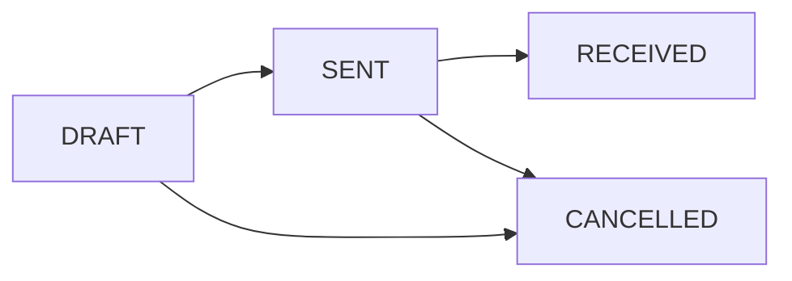

# PHASE 3: Queues, Alerts & Purchase Orders

**Status:** Complete  
**Branch:** `feature/queues-alerts`  
**Duration:** ~10 hours  
**Focus:** Async workflows that do not slow down inventory movements

---

## Goal

Implement background processing so that:

1. Movement APIs stay fast and transaction-safe
2. Low-stock alerts are created asynchronously after stock changes
3. Duplicate open alerts are prevented
4. Purchase order state transitions are enforced server-side
5. Receiving a purchase order creates stock receipt movements atomically
6. CSV imports run in a worker with row-level status tracking

---

## Assignment mapping

| Requirement | Implementation |
|-------------|----------------|
| Async jobs | BullMQ workers backed by Redis |
| Low-stock alerts | Alert job after receipt / adjustment / transfer commits |
| Alert dedupe | PostgreSQL partial unique index for one OPEN alert per SKU + warehouse |
| Alert lifecycle | Acknowledge / resolve endpoints with audit logs |
| Reorder from alert | Purchase order created from an alert |
| PO state machine | `DRAFT -> SENT -> RECEIVED` or `CANCELLED` |
| PO receive | Atomic stock receipt movements for PO lines |
| CSV import | Import record + worker-processed import rows |

---

## Phase 3 prep already completed

Before writing services, fix the schema constraints that would break real workflows:

- Alert dedupe is now modeled as **one OPEN alert** per `(skuId, warehouseId)`, not one alert forever.
- Purchase order audit logs are now one-to-many, so each status change can be audited.

Verification:

```bash
pnpm --dir apps/backend exec prisma migrate deploy
pnpm --dir apps/backend exec prisma generate
pnpm --dir apps/backend exec tsc --noEmit
pnpm --dir apps/backend test:int
```

---

## Architecture



### Important transaction rule

Alerts are **not** created inside the movement transaction.

Correct flow:

1. Receipt / adjustment / transfer transaction starts
2. Inventory snapshot + stock movement ledger are updated
3. Transaction commits
4. Alert job is enqueued
5. Worker checks current stock and creates alert if needed

Why:

- Stock correctness is critical path
- Alerts are non-critical path
- A failed Redis enqueue must not roll back inventory movement

---

## File plan

| File | Purpose |
|------|---------|
| `src/lib/queues.ts` | BullMQ Queue instances + shared Redis connection config |
| `src/workers/index.ts` | Worker process entry point |
| `src/jobs/alert.jobs.ts` | Alert job names, payloads, enqueue helpers |
| `src/jobs/import.jobs.ts` | Import job names, payloads, enqueue helpers |
| `src/services/alert.service.ts` | Low-stock checks + alert lifecycle logic |
| `src/services/purchase-order.service.ts` | PO creation, state machine, receive logic |
| `src/services/import.service.ts` | Create import records + row processing helpers |
| `src/routes/alerts.ts` | Alert HTTP API |
| `src/routes/purchase-orders.ts` | Purchase order HTTP API |
| `src/routes/imports.ts` | Import HTTP API |
| `src/schemas/alert.schemas.ts` | Zod request validation |
| `src/schemas/purchase-order.schemas.ts` | Zod request validation |
| `src/schemas/import.schemas.ts` | Zod request validation |
| `src/types/alert.types.ts` | Alert constants + response types |
| `src/types/purchase-order.types.ts` | PO status constants + response types |
| `src/types/import.types.ts` | Import status/type constants |
| `src/app.ts` | Register new route prefixes |
| `package.json` | Add worker scripts |

---

## Dependency

Phase 3 needs BullMQ.

Ask before running:

```bash
pnpm --dir apps/backend add bullmq
```

Suggested scripts:

```json
{
  "worker": "tsx src/workers/index.ts",
  "dev:worker": "tsx watch src/workers/index.ts"
}
```

Run API and worker in two terminals:

```bash
pnpm --dir apps/backend dev
pnpm --dir apps/backend dev:worker
```

---

## Queue design

### Queue names

| Queue | Job | Purpose |
|-------|-----|---------|
| `alerts` | `check-low-stock` | Check SKU + warehouse after stock changes |
| `imports` | `process-import` | Process CSV/import rows in background |
| `po-fulfillment` | `receive-purchase-order` | Optional async PO receiving path |

### Alert job payload

```ts
type CheckLowStockJob = {
  skuId: string;
  warehouseId: string;
  movementId?: string;
};
```

### Job options

Use retries for transient Redis/DB failures:

```ts
{
  attempts: 3,
  backoff: { type: "exponential", delay: 1000 },
  removeOnComplete: true,
  removeOnFail: 100,
}
```

---

## Alert behavior

### When to enqueue

After any movement that changes stock:

| Movement | Warehouses to check |
|----------|---------------------|
| Receipt | destination warehouse |
| Adjustment | adjusted warehouse |
| Transfer | source and destination warehouse |

### Worker logic

1. Fetch `InventoryStock` for `(skuId, warehouseId)`
2. Fetch SKU reorder threshold
3. Compute `available = stockLevel - reserved`
4. If `available >= reorderThreshold`, do nothing
5. If `available < reorderThreshold`, create `Alert(status = OPEN)`
6. If an OPEN alert already exists, do nothing

### Deduplication

Database is the final guard:

```sql
CREATE UNIQUE INDEX "Alert_open_sku_warehouse_unique"
ON "Alert"("skuId", "warehouseId")
WHERE "status" = 'OPEN';
```

Service should still check first for clearer behavior, but DB prevents race duplicates.

---

## Alert API

| Method | Path | Auth | Role |
|--------|------|------|------|
| GET | `/alerts` | Yes | Manager, Operator |
| GET | `/alerts/:id` | Yes | Manager, Operator |
| PATCH | `/alerts/:id/acknowledge` | Yes | Manager |
| PATCH | `/alerts/:id/resolve` | Yes | Manager |

### Lifecycle



Every transition writes `AlertAuditLog`.

---

## Purchase order behavior

### State machine



### Rules

| Action | Allowed from | Role |
|--------|--------------|------|
| Create from alert | `OPEN` or `ACKNOWLEDGED` alert | Manager |
| Send PO | `DRAFT` | Manager |
| Receive PO | `SENT` | Manager, Operator |
| Cancel PO | `DRAFT` or `SENT` | Manager |

### PO receive transaction

1. Load PO + line items
2. Validate status is `SENT`
3. For each line, create receipt movement through existing stock logic
4. Update line `quantityReceived`
5. Mark PO `RECEIVED`
6. Write `PurchaseOrderAuditLog`
7. Commit all or rollback all

### Important implementation note

Prefer extracting reusable receipt logic from `movementService.receipt` if needed, so PO receive and movement receipt share the same inventory-safe path.

---

## Purchase order API

| Method | Path | Auth | Role |
|--------|------|------|------|
| POST | `/purchase-orders/from-alert` | Yes | Manager |
| GET | `/purchase-orders` | Yes | Manager, Operator |
| GET | `/purchase-orders/:id` | Yes | Manager, Operator |
| POST | `/purchase-orders/:id/send` | Yes | Manager |
| POST | `/purchase-orders/:id/receive` | Yes | Manager, Operator |
| POST | `/purchase-orders/:id/cancel` | Yes | Manager |

---

## CSV import behavior

Phase 3 MVP should scaffold the background import path.

### Import API

| Method | Path | Auth | Role |
|--------|------|------|------|
| POST | `/imports` | Yes | Manager |
| GET | `/imports/:id` | Yes | Manager, Operator |
| GET | `/imports/:id/rows` | Yes | Manager, Operator |

### Import flow

1. API receives a parsed/simple import payload or local CSV reference
2. Create `Import(status = PENDING)`
3. Create `ImportRow(status = PENDING)` rows
4. Enqueue `process-import`
5. Worker marks import `IN_PROGRESS`
6. Process rows independently
7. Mark rows `SUCCESS` or `FAILED`
8. Mark import `COMPLETED` or `FAILED`

Partial failures are expected: one bad row should not roll back successful rows.

---

## Manual verification

### Start services

```bash
docker-compose up -d
pnpm --dir apps/backend dev
pnpm --dir apps/backend dev:worker
```

### Verify alert creation

1. Create SKU with `reorderThreshold = 10`
2. Receipt 12 units
3. Transfer/adjust down to 5 available
4. Wait 1-2 seconds
5. `GET /alerts` should show one OPEN alert
6. Repeat movement while still low
7. `GET /alerts` should still show only one OPEN alert

### Verify alert lifecycle

1. Acknowledge alert
2. Resolve alert
3. Drop stock low again
4. New OPEN alert should be created because old one is resolved

### Verify PO lifecycle

1. Create PO from alert
2. Send PO
3. Receive PO
4. Inventory increases
5. Stock movement ledger has RECEIPT rows
6. PO audit log has multiple rows

---

## Phase 3 exit checklist

- [x] BullMQ installed
- [x] Worker process starts and shuts down cleanly
- [x] Alert queue enqueues after movement commit
- [x] Low-stock alert created asynchronously
- [x] Duplicate OPEN alerts prevented
- [x] Resolved alert does not block future alert
- [x] Alert acknowledge / resolve writes audit logs
- [x] PO state machine rejects invalid transitions
- [x] PO receive creates receipt movements atomically
- [x] PO audit supports multiple state changes
- [x] CSV import worker scaffold processes rows independently
- [x] TypeScript clean (`pnpm --dir apps/backend exec tsc --noEmit`)

---

## Suggested commits (ask before each)

1. `fix: align phase 3 alert and po audit constraints`
2. `docs: add phase 3 queues and alerts plan`
3. `feat: add bullmq worker infrastructure`
4. `feat: enqueue low stock alert checks after movements`
5. `feat: add alert lifecycle apis`
6. `feat: implement purchase order state machine`
7. `feat: receive purchase orders into inventory`
8. `feat: add csv import worker scaffold`
9. `docs: update project tracker for phase 3 progress`
