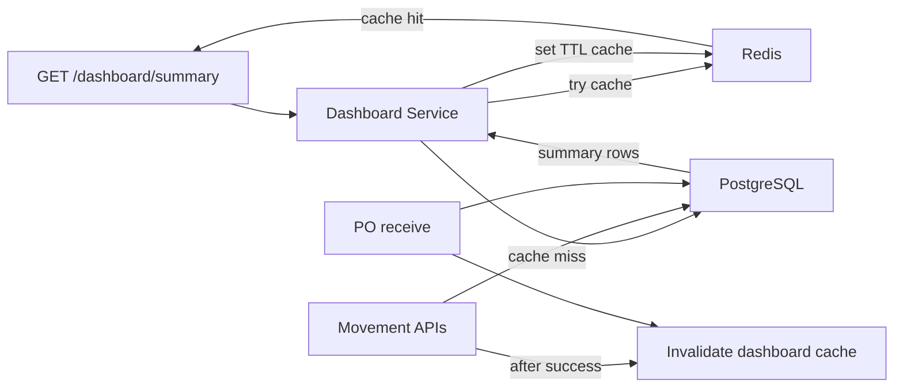

# PHASE 4: Caching & Performance

**Status:** Complete  
**Branch:** `feature/dashboard-cache-performance`  
**Duration:** ~8 hours  
**Focus:** Fast dashboard reads, cache freshness, and seeded performance proof

---

## Goal

Implement performance-focused backend work so that:

1. Dashboard summary reads are fast and cacheable
2. Dashboard cache is refreshed after inventory-changing writes
3. Redis cache never hides stock changes for more than a short TTL
4. Local performance dataset can exercise dashboard and movement queries
5. Slow queries are inspected with `EXPLAIN ANALYZE`

---

## Assignment mapping

| Requirement | Implementation |
|-------------|----------------|
| Dashboard cache | `GET /dashboard/summary` backed by Redis |
| Cache freshness | Short TTL + explicit invalidation after stock-affecting writes |
| Seed data | Performance seed script for 5 warehouses, 10k SKUs, 500k movements |
| Query tuning | EXPLAIN helper script for dashboard and movement queries |
| Existing cache pattern | Reuse `sku-cache.ts` style with explicit Redis helpers |

---

## Architecture



### Cache rule

Dashboard cache is a performance layer only. PostgreSQL remains the source of truth.

If Redis fails:

- dashboard still returns DB data when possible
- cache errors are logged
- inventory writes are not rolled back because cache invalidation failed

---

## API endpoint

| Method | Path | Auth | Role |
|--------|------|------|------|
| GET | `/dashboard/summary` | Yes | Manager, Operator |

Optional query:

```txt
warehouseId=...
```

Response fields:

```json
{
  "scope": "global",
  "warehouseId": null,
  "activeSkuCount": 10000,
  "activeWarehouseCount": 5,
  "totalStockUnits": 500000,
  "totalReservedUnits": 100,
  "totalAvailableUnits": 499900,
  "inventoryValue": "123456.78",
  "lowStockCount": 42,
  "openAlertsCount": 7,
  "activePurchaseOrdersCount": 3,
  "recentMovementCount": 250,
  "generatedAt": "..."
}
```

Headers:

```txt
X-Cache: HIT | MISS
```

---

## Cache keys

```txt
dashboard:summary:global
dashboard:summary:warehouse:{warehouseId}
```

TTL:

```txt
5 seconds
```

Why 5 seconds:

- keeps dashboard fast under repeated refresh
- keeps assignment freshness target easy to reason about
- explicit invalidation still makes most writes visible immediately

---

## Invalidation points

Invalidate `dashboard:summary:*` after successful writes that change dashboard numbers:

| Write | Why invalidate |
-------|----------------|
| receipt | stock totals and value changed |
| adjustment | stock totals and low-stock count may change |
| transfer | source/destination warehouse totals changed |
| PO receive | stock increased through receipt movements |
| SKU update/delete | active SKU count, unit cost, reorder threshold may change |
| Warehouse update/delete | active warehouse count may change |

Invalidation happens after DB success. If Redis invalidation fails, log and continue.

---

## File plan

| File | Purpose |
|------|---------|
| `src/types/dashboard.types.ts` | Dashboard response types |
| `src/schemas/dashboard.schemas.ts` | Zod query validation |
| `src/lib/dashboard-cache.ts` | Redis get/set/invalidate helpers |
| `src/services/dashboard.service.ts` | DB summary query + cache orchestration |
| `src/routes/dashboard.ts` | HTTP route and `X-Cache` header |
| `src/scripts/explain-performance.ts` | EXPLAIN helper for key queries |
| `prisma/seed-performance.ts` | Large deterministic performance seed |
| `package.json` | `db:seed:perf` and `perf:explain` scripts |

---

## Performance seed

Target:

- 5 warehouses
- 10,000 SKUs
- inventory rows across warehouses
- 500,000 stock movement rows

Rules:

- use `PERF_` prefixes so seed data is identifiable
- insert in chunks with `createMany`
- print progress
- avoid deleting normal development data

---

## EXPLAIN targets

Inspect these queries:

1. Global dashboard summary
2. Warehouse dashboard summary
3. Recent movement query
4. Low-stock inventory query

Only add indexes if EXPLAIN shows sequential scans or slow plans on seeded data.

Result:

- recent movement history originally used a parallel sequential scan over 500k rows
- added `StockMovement_createdAt_idx`
- recent movement plan changed to backward index scan
- measured execution improved from ~34ms to ~0.12ms on the seeded dataset

---

## Manual verification

```bash
pnpm --dir apps/backend dev

# First call should miss cache
curl -i http://localhost:4000/dashboard/summary \
  -H "Authorization: Bearer $TOKEN"

# Second call should hit cache
curl -i http://localhost:4000/dashboard/summary \
  -H "Authorization: Bearer $TOKEN"

# Make a movement, then dashboard should miss again and show fresh stock totals
curl -X POST http://localhost:4000/movements/receipt ...
curl -i http://localhost:4000/dashboard/summary \
  -H "Authorization: Bearer $TOKEN"
```

Expected:

- first dashboard call: `X-Cache: MISS`
- second dashboard call: `X-Cache: HIT`
- movement invalidates cache
- next dashboard call: `X-Cache: MISS`
- values reflect the latest inventory snapshot

---

## Phase 4 exit checklist

- [x] `GET /dashboard/summary` works globally
- [x] `GET /dashboard/summary?warehouseId=...` works per warehouse
- [x] Dashboard cache returns `X-Cache: HIT` on second request
- [x] Movement write invalidates dashboard cache
- [x] PO receive invalidates dashboard cache
- [x] SKU and warehouse mutations invalidate dashboard cache
- [x] Performance seed script creates target dataset
- [x] EXPLAIN helper runs key query plans
- [x] TypeScript clean (`pnpm --dir apps/backend exec tsc --noEmit`)
- [x] Phase 2 concurrency test still passes (`pnpm --dir apps/backend test:int`)

---

## Suggested commits (ask before each)

1. `docs: add phase 4 caching and performance plan`
2. `feat: add cached dashboard summary api`
3. `feat: invalidate dashboard cache after inventory writes`
4. `feat: add performance seed script`
5. `chore: add dashboard query explain helper`
6. `docs: update project tracker for phase 4 progress`
