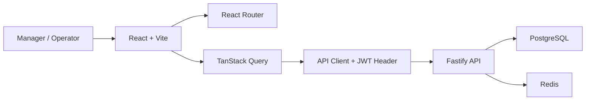

# PHASE 5: Frontend Integration

**Status:** Complete — core frontend integration verified  
**Branch:** `feature/frontend-integration`  
**Duration:** ~12 hours  
**Focus:** React dashboard, authenticated workflows, and frontend API integration

---

## Goal

Turn the completed backend APIs from Phases 1-4 into a usable frontend for inventory operators and managers.

Phase 5 is not about heavy visual polish. It is about proving the full product workflow:

1. Users can log in and keep a JWT session
2. Dashboard shows real backend metrics
3. Managers can manage SKU and warehouse master data
4. Operators/managers can create stock movements
5. Movement history is visible in a table
6. Alerts, purchase orders, and imports can be operated from the UI
7. Frontend refreshes data after writes using TanStack Query invalidation

---

## Current State

The backend is ready through Phase 4:

- Auth and RBAC
- Warehouse and SKU CRUD
- Atomic stock movements
- Alerts, POs, imports, and workers
- Cached dashboard summary
- Performance seed and query tuning

The frontend currently uses the default Vite starter app. Phase 5 replaces that starter UI with real InventoryHub screens.

---

## Architecture



Rules:

- Backend remains the source of truth for validation, auth, RBAC, and inventory correctness.
- Frontend uses role-aware UI to hide manager-only actions, but backend still enforces permissions.
- TanStack Query owns server state; local React state is only for form fields and view filters.

---

## Dependencies

Add to `apps/frontend`:

| Package | Why |
|---------|-----|
| `@tanstack/react-query` | Server-state fetching, caching, mutation invalidation |
| `@tanstack/react-table` | Movement and import row tables |
| `react-router-dom` | Page routing and protected routes |
| `react-hook-form` | Form state for login, master data, and movement forms |
| `zod` | Client-side validation matching backend expectations |

---

## Screens

### Login

- `POST /auth/login`
- Store `accessToken`
- Store user role/email/id from response
- Redirect authenticated users to dashboard

### Dashboard

- `GET /dashboard/summary`
- Show active SKUs, warehouses, stock units, available units, inventory value, low-stock count, open alerts, active POs, recent movements
- Refresh button
- Loading, error, and empty states

### Warehouses

- `GET /warehouses`
- `POST /warehouses`
- `PATCH /warehouses/:id`
- `DELETE /warehouses/:id`
- Manager-only create/edit/delete controls

### SKUs

- `GET /skus`
- `POST /skus`
- `PATCH /skus/:id`
- `DELETE /skus/:id`
- Manager-only create/edit/delete controls

### Movements

- `POST /movements/receipt`
- `POST /movements/adjustment`
- `POST /movements/transfer`
- `GET /movements` for movement history
- Invalidate dashboard and movement-history queries after each write

### Alerts

- `GET /alerts`
- `PATCH /alerts/:id/acknowledge`
- `PATCH /alerts/:id/resolve`

### Purchase Orders

- `GET /purchase-orders`
- `POST /purchase-orders/from-alert`
- `POST /purchase-orders/:id/send`
- `POST /purchase-orders/:id/receive`
- `POST /purchase-orders/:id/cancel`

### Imports

- `POST /imports`
- `GET /imports/:id`
- `GET /imports/:id/rows`

---

## Backend Gap

The backend currently creates movements but does not list movement history. Phase 5 needs a read endpoint for TanStack Table:

```txt
GET /movements?page=1&perPage=25&type=&skuId=&warehouseId=
```

Requirements:

- authenticated
- manager/operator readable
- newest first
- paginated
- optional filters by type, SKU, warehouse
- no inventory writes

---

## Query Keys

Use stable query keys:

```txt
auth/user
dashboard/summary
warehouses/list
skus/list
movements/history
alerts/list
purchase-orders/list
imports/detail
imports/rows
```

Invalidate after writes:

| Mutation | Invalidate |
|----------|------------|
| receipt / adjustment / transfer | dashboard, movements, alerts |
| SKU create/update/delete | skus, dashboard |
| warehouse create/update/delete | warehouses, dashboard |
| alert acknowledge/resolve | alerts, dashboard |
| PO receive | purchase-orders, dashboard, movements, alerts |
| import create | import detail, import rows, skus |

---

## Frontend File Plan

| File/Folder | Purpose |
|-------------|---------|
| `src/lib/api.ts` | Fetch wrapper, base URL, auth header, API errors |
| `src/lib/auth.ts` | Token/user storage helpers |
| `src/lib/query-client.ts` | TanStack Query client |
| `src/types/api.ts` | DTOs shared by frontend pages |
| `src/routes.tsx` | React Router route map |
| `src/layouts/AppLayout.tsx` | Authenticated shell with sidebar/header |
| `src/components/*` | Shared UI: cards, buttons, forms, tables, states |
| `src/pages/*` | Login, dashboard, warehouses, SKUs, movements, alerts, POs, imports |

---

## Verification

Backend:

```bash
pnpm --dir apps/backend exec tsc --noEmit
pnpm --dir apps/backend test:int
```

Frontend:

```bash
pnpm --dir apps/frontend build
pnpm --dir apps/frontend lint
```

Manual UI checks:

- [x] Manager login works
- [x] Operator login works
- [x] Dashboard loads backend values
- [x] Dashboard refresh works
- [x] Warehouse list loads
- [x] SKU list loads
- [x] Manager can create/edit/delete SKU and warehouse records
- [x] Operator does not see manager-only mutation controls
- [x] Receipt creates stock movement
- [x] Adjustment creates stock movement
- [x] Transfer creates stock movement
- [x] Movement history updates after movement mutation
- [x] Alerts list loads and acknowledge/resolve work
- [x] PO list loads and send/receive/cancel work
- [x] Import status and rows can be viewed

---

## Exit Checklist

- [x] Phase 5 branch created from latest `main`
- [x] `PHASE_5_FRONTEND_PLAN.md` created
- [x] Frontend dependencies installed
- [x] Login/auth flow implemented
- [x] App layout and protected routes implemented
- [x] Dashboard page implemented
- [x] Movement history backend endpoint implemented
- [x] Warehouse and SKU pages implemented
- [x] Movement forms implemented
- [x] Alerts, purchase orders, and imports pages implemented
- [x] Frontend build passes
- [x] Frontend lint passes
- [x] Backend TypeScript passes
- [x] Backend integration tests pass
- [x] Manual browser verification complete
- [x] Manager edit flows polished for warehouse/SKU records
- [x] Alert and purchase order list response shapes fixed
- [x] Import UI uses CSV rows instead of raw JSON
- [x] Dashboard warehouse filter implemented
- [x] SKU search, movement filters, alert status filter, and PO status filter implemented

---

## Suggested Commits

Ask before committing.

1. `docs: add phase 5 frontend integration plan`
2. `feat: add frontend auth and app shell`
3. `feat: add dashboard and master data pages`
4. `feat: add movement history and stock movement forms`
5. `feat: add alerts purchase orders and imports views`
6. `docs: mark phase 5 progress in tracker`
